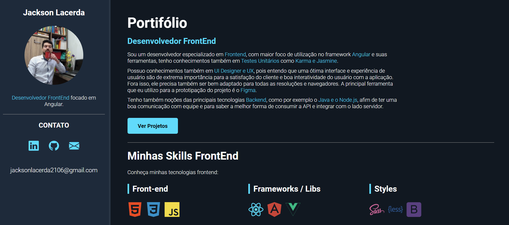
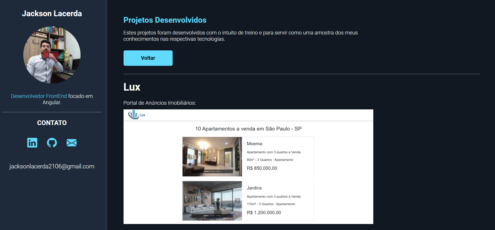

<h1 align="center">
  Portfolio
</h1>

<br>

<p align="center">
  
  
</p>

## Deploy do Projeto

Esta aplicação está em produção no link abaixo:

<p align="left">
  <a href="https://jacksonlacerda.github.io/portfolio/">
    Portfolio
  </a>
</p>

## Tecnologias

Esse projeto foi desenvolvido com as seguintes tecnologias:

- [Angular](https://angular.io/)
- [Typescript](https://www.typescriptlang.org/)
- [HTML](https://www.w3.org/)
- [CSS](https://www.w3.org/)

## Como executar

Clone o projeto e acesse a pasta do mesmo.

```bash
# Selecionar a pasta para clonar o projeto
$ cd suapasta

# Clonar o projeto
$ git clone https://github.com/jacksonlacerda/portfolio.git
```

Para iniciá-lo, siga os passos abaixo:
```bash
# Instalar as dependências
$ npm install

# Iniciar o projeto
$ ng serve --open
```
O app estará disponível no seu browser pelo endereço http://localhost:4200.

## Projeto

Este é um portfólio para apresentar minhas tecnologias e meus principais projetos.

## Commits Semânticos

- `feat`: Adições ao código ou novas funcionalidades.
- `refactor`: Edições do código que não alterem sua funcionalidade.
- `fix`: Correção de bugs.
- `style`: Alteração em estilos.
- `static`: Alterações no conteúdo de arquivos estáticos.
- `test`: Criação de testes da sua aplicação.
- `docs`: Alterações na documentação.
- `build`: Modificação em arquivos de build.

## License

Esse projeto está sob a licença MIT. Veja o arquivo [LICENSE](LICENSE) para mais detalhes.

